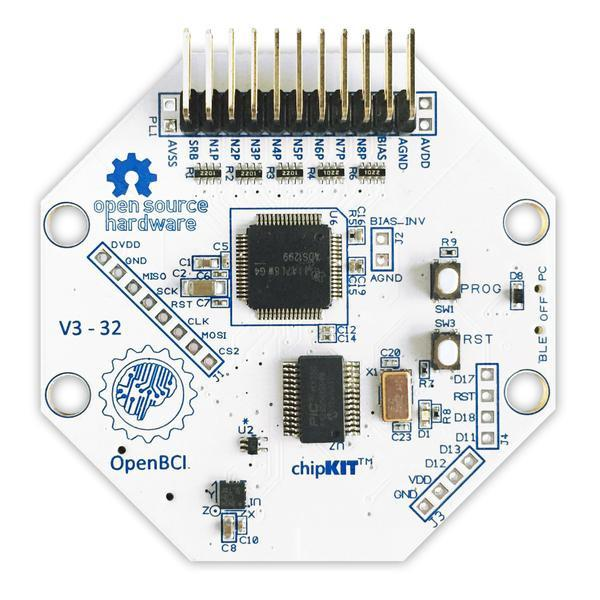

# SSVEP-BASED BCI

## 1. The goal of the project 
My main goal was to create a brain-computer interface based on steady-state visual evoked potentials and the EEG method. It was implemented in Python. At this point, the interface is **not** yet finished. For now, I managed to write the whole experiment offline. It can be used to collect data to train a classifier, a neural network, for example. 

## 2. Stimulation interface

The photo above shows a view of the interface with the stimuli. The Psychopy library is responsible for the GUI and stimulus flashing controls. Signals controlling the blinking were generated using the scipy library. The stimuli were encoded using the so-called joint frequency, phase and waveform modulation method, which means that each stimulus flashes according to the values of the generated periodic functions, and individual stimuli are controlled by signals with different shapes, phase shifts, and frequencies. Such a method is intended to facilitate the recognition of stimuli when there are a lot of them and the frequency differences between them are small. The disadvantage of such a solution is the need for more complex classification methods - for example, standard methods based on the fast Fourier transform will not work. 

## 3. EEG data acquisition

To collect data and test the interface, I used an 8-channel Cyton amplifier from OpenBCI with a sampling rate of 250 Hz.   

## 4. Bibliography

OpenBCI Cyton: https://docs.openbci.com/Cyton/CytonLanding
